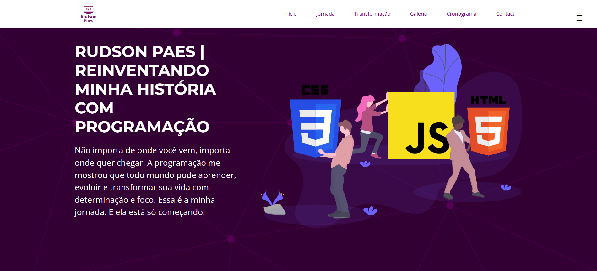
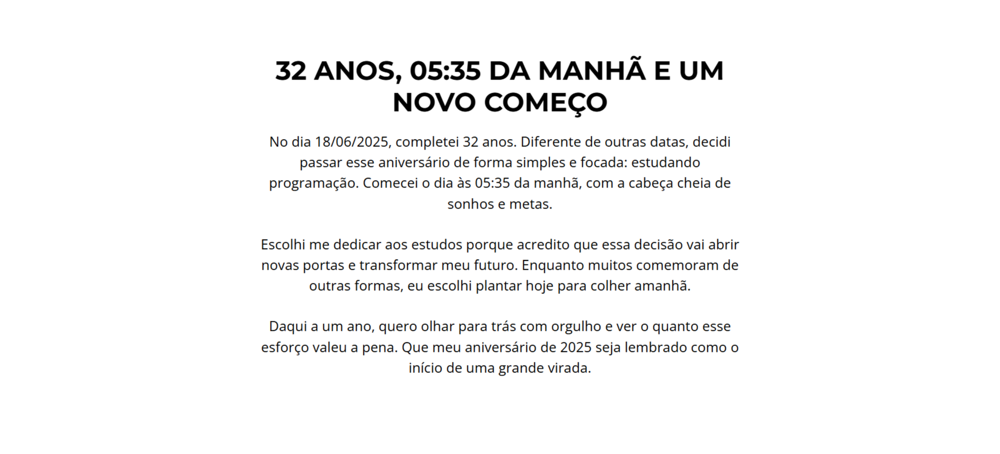
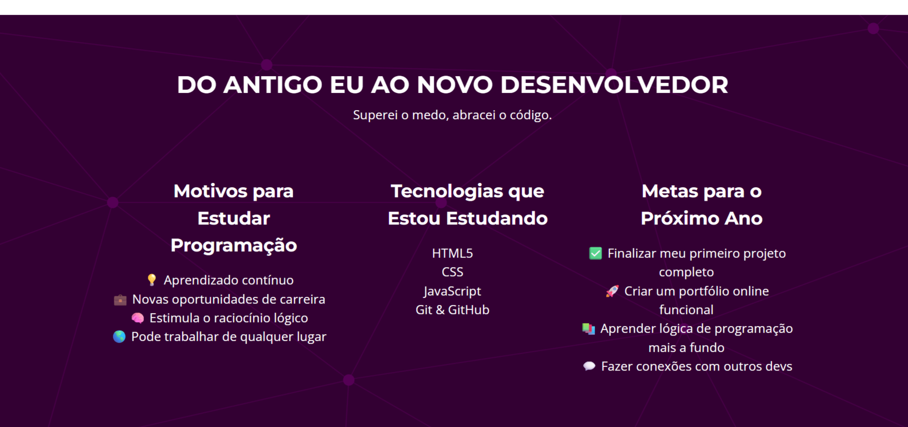
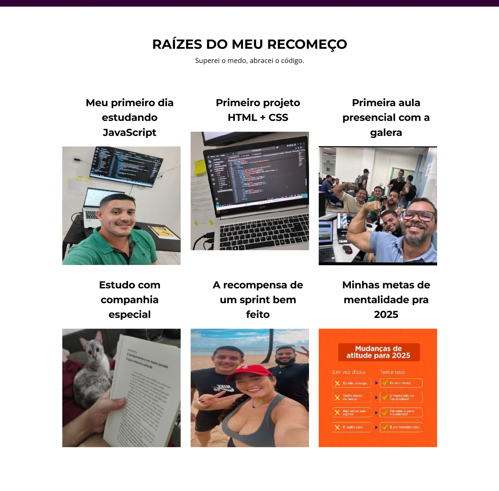
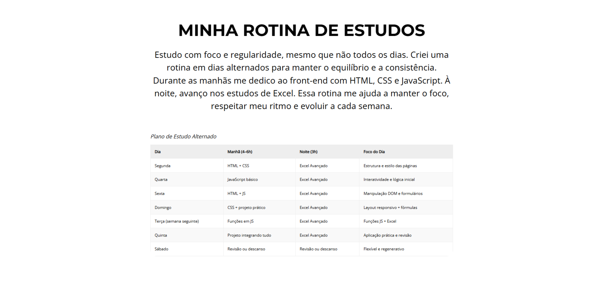
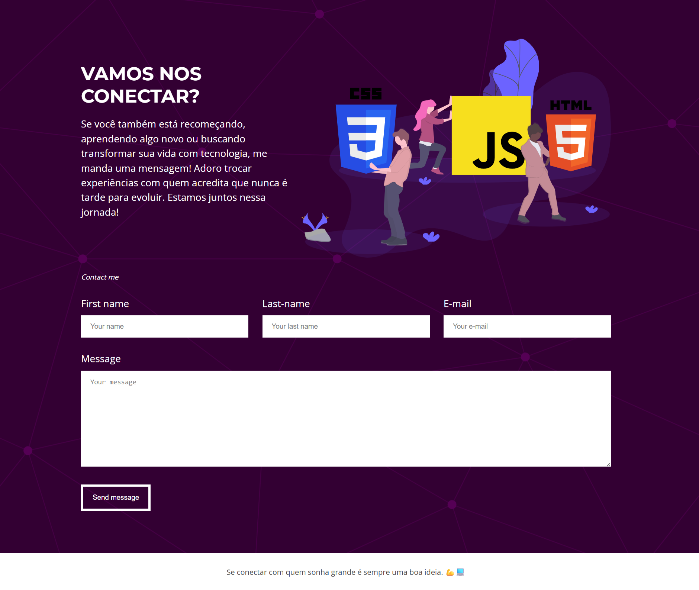

# 🌱 Meu Começo na Programação

Este é meu **primeiro projeto** como desenvolvedor. Uma landing page que marca o início da minha jornada na programação, construída com dedicação e estudo. Mais que código, é um sonho começando a ganhar forma!

---

## ✍️ Sobre

📄 Projeto pessoal feito para treinar e contar minha história com a programação.

🛠 Tecnologias usadas:
- HTML5
- CSS3
- Git & GitHub

---

## 🧭 Minha Jornada

🎂 Comecei no dia 18/06/2025, às 05:35 da manhã, no meu aniversário de 32 anos.

📚 Estudo **um dia sim, outro não**, aproveitando as folgas do trabalho.

🎯 Estou comprometido com uma mudança real de vida.

---

## 🚀 Metas & Motivações

💡 Por que escolhi a programação:
- Aprendizado contínuo
- Raciocínio lógico
- Trabalho remoto
- Nova carreira

🎯 Minhas metas:
- Finalizar este projeto ✅
- Criar um portfólio online
- Aprender lógica com profundidade
- Me conectar com outros devs

---

## 🌐 Acesse o Projeto

🔗 [Ver landing page online](https://brilliant-otter-4b99f6.netlify.app/)

---

## 📸 Galeria

  
  
  
  
  

---

## 🤝 Vamos nos Conectar!

📧 **Email:** [rudsonpaes3@gmail.com](mailto:rudsonpaes3@gmail.com)  
💼 **LinkedIn:** [linkedin.com/in/rudsonpaes](https://www.linkedin.com/in/rudsonpaes/)

> “Se conectar com quem sonha grande é sempre uma boa ideia. 💪📘”
